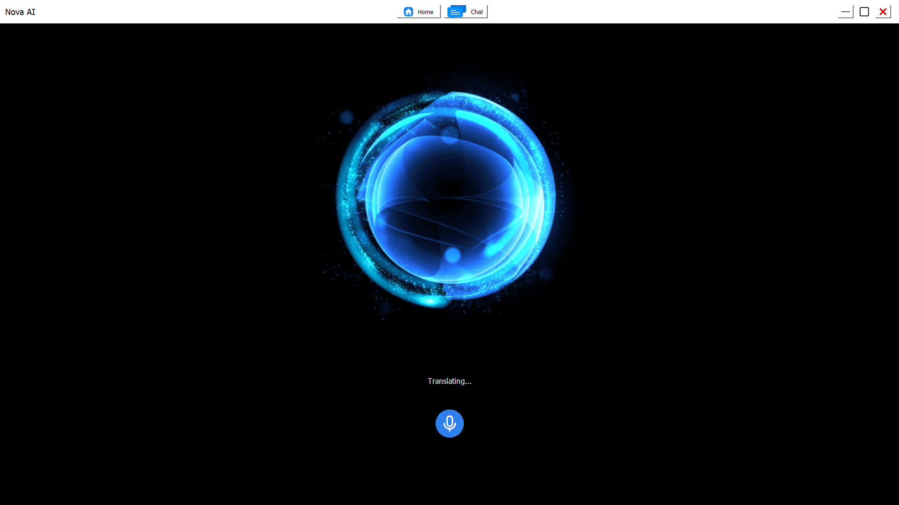
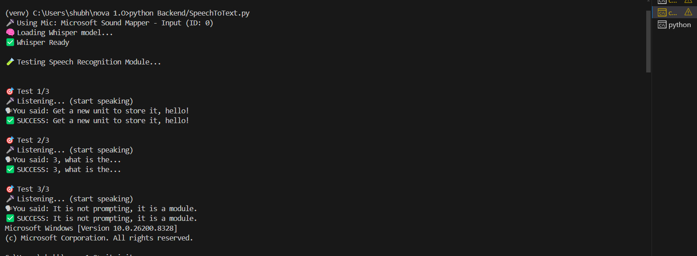
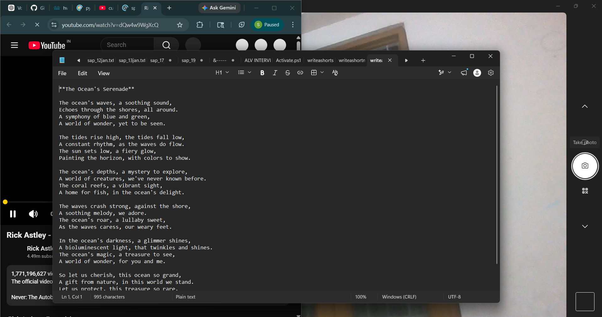

# 🌌 Nova AI Assistant

<div align="center">

# 🚀 AI Powered Intelligent Voice Assistant

### *Real-Time Voice Interaction • AI Automation • Intelligent Decision Making*


---

### 🧠 "Nova bridges the gap between traditional assistants and intelligent real-time AI systems."

</div>

---

# 📌 Overview

Nova is an advanced AI-powered intelligent assistant designed to simplify human-computer interaction through:

- 🎤 Real-time voice communication
- 🧠 AI-based decision making
- ⚡ Intelligent automation
- 🎨 AI image generation
- 📝 Content generation
- 🌐 Real-time information retrieval
- 🖥 Interactive GUI integration

Nova combines Speech Recognition, NLP, Automation, and AI into one scalable and modular ecosystem.

---

# 🚀 Key Features

## 🎤 Advanced Speech Recognition
- Faster-Whisper powered offline STT
- Real-time speech processing
- Multilingual support
- Intelligent silence detection
- Context-aware voice interaction

---

## 🔊 Natural Text-to-Speech
- Human-like AI voice
- Edge-TTS integration
- Real-time audio synthesis
- Non-blocking threaded playback

---

## 🧠 AI Decision-Making Model
Nova intelligently classifies:
- General conversation
- Real-time queries
- Automation commands
- Image generation prompts
- Content generation requests

---

## ⚡ Intelligent Automation
Nova can:
- Open/close applications
- Perform web searches
- Execute system commands
- Control workflows via voice

---

## 🎨 AI Image Generation
Generate AI-powered images using natural language prompts.

### Example:
```text
"Generate a futuristic cyberpunk city"
```

---

## 📝 AI Content Generation
Generate:
- Blogs
- Notes
- Essays
- Captions
- Articles
- Creative content

---

## 🖥 Modern GUI Interface
- PyQt5-based interface
- Animated assistant visuals
- Real-time status updates
- Interactive conversation display

---

# 📸 Screenshots

## 🖥 Main GUI

<p align="center">
  
</p>

<p align="center">
  <b>Nova Interactive GUI Interface</b>
</p>

---

## 🎤 Speech Recognition

<p align="center">
  
</p>

<p align="center">
  <b>Real-Time Speech Recognition using Faster-Whisper</b>
</p>

---

## 🎨 AI Image Generation

<p align="center">
  
</p>

<p align="center">
  <b>AI-Powered Image Generation Module</b>
</p>

---

## ⚡ Automation Demo

<p align="center">
  
</p>

<p align="center">
  <b>Voice-Based Intelligent Automation</b>
</p>

---

# 🏗 System Architecture

```text
User Voice Input
        ↓
Speech Recognition (Whisper)
        ↓
Decision-Making Model
        ↓
Task Routing Engine
 ┌────────────┬────────────┬────────────┐
 │ Chatbot    │ Automation │ Image Gen │
 └────────────┴────────────┴────────────┘
        ↓
Text-to-Speech Engine
        ↓
GUI + Audio Response
```

---

# 📂 Project Structure

```bash
NOVA 1.O/
│
├── Backend/
│   ├── __init__.py
│   ├── Automation.py
│   ├── Chatbot.py
│   ├── Image_Generation.py
│   ├── Model.py
│   ├── Realtime.py
│   ├── sd.py
│   ├── SpeechToText.py
│   ├── state.py
│   └── TTS.py
│
├── Frontend/
│   ├── __pycache__/
│   ├── Graphics/
│   ├── __init__.py
│   └── GUI.py
│
├── screenshots/
│   ├── .gitkeep
│   ├── automation.png
│   ├── gui.png
│   ├── image_generation.png
│   └── stt.png
│
├── Data/
│
├── requirements.txt
├── README.md
├── Main.py
├── .gitignore
└── .env
```

---

# 🧩 Tech Stack

| Technology | Purpose |
|---|---|
| Python | Core Backend |
| Faster-Whisper | Speech Recognition |
| Groq / LLM APIs | AI Reasoning |
| Edge-TTS | Text-to-Speech |
| PyQt5 | GUI Interface |
| NumPy / SciPy | Audio Processing |
| SoundDevice | Real-time Audio Capture |
| Asyncio / Threading | Concurrent Processing |

---

# 🎯 Unique Value Proposition (UVP)

Unlike traditional assistants, Nova provides:

```text
✔ Modular AI Architecture
✔ Offline-capable Speech Recognition
✔ Intelligent Task Routing
✔ Real-time Voice Interaction
✔ AI-powered Automation
✔ Image & Content Generation
✔ Fully Customizable Backend
```

Nova combines:

```text
AI + NLP + Automation + GUI + Voice Interaction
```

into one integrated intelligent platform.

---

# 🚨 Technological Gaps Solved

| Existing Limitations | Nova Solution |
|---|---|
| Closed AI ecosystems | Modular architecture |
| Heavy cloud dependency | Offline STT |
| Rigid command systems | Context-aware AI |
| Weak automation | Intelligent task execution |
| Limited customization | Developer-friendly design |

---

# ⚙️ Installation

## 1️⃣ Clone Repository

```bash
git clone https://github.com/yourusername/nova-ai.git
cd nova-ai
```

---

## 2️⃣ Create Virtual Environment

```bash
python -m venv venv
```

### Activate Environment

#### Windows
```bash
venv\Scripts\activate
```

#### Linux / Mac
```bash
source venv/bin/activate
```

---

## 3️⃣ Install Dependencies

```bash
pip install -r requirements.txt
```

---

# 🔑 Environment Variables

Create `.env`

```env
GroqAPIKey=YOUR_API_KEY

Assistantname=Nova
Username=User

InputLanguage=en-US
AssistantVoice=en-US-JennyNeural
```

---

# 📦 requirements.txt

```txt
numpy
sounddevice
scipy
faster-whisper
python-dotenv
edge-tts
groq
PyQt5
requests
Pillow
```

---

# ▶️ Running Nova

```bash
python Main.py
```

---

# 🎤 Example Commands

## 💬 General Conversation

```text
"Who are you?"
"Tell me a joke"
```

---

## ⚡ Automation

```text
"Open Spotify"
"Search YouTube for AI videos"
```

---

## 🌐 Real-Time Search

```text
"What is the weather today?"
"Latest AI news"
```

---

## 🎨 Image Generation

```text
"Generate an image of Lord Krishna"
"Create futuristic robot art"
```

---

## 📝 Content Generation

```text
"Write a blog on artificial intelligence"
"Generate caption for Instagram"
```

---

# 🧠 Motivation Behind Nova

The primary goal of Nova is to bridge the technological gap between traditional rule-based assistants and modern intelligent AI systems.

Nova was designed to:
- simplify digital interaction
- improve productivity
- enable natural human-computer communication
- integrate AI reasoning with automation
- provide a scalable assistant ecosystem

---

# 🚀 Future Scope

- Wake-word Detection ("Hey Nova")
- Real-time Streaming STT
- Long-term AI Memory
- Smart Home Integration
- Mobile Application
- Autonomous AI Agent Workflows

---

# 👨‍💻 Author

## Shubhanshu Omer

AI Developer | NLP Enthusiast | Automation Engineer

---

# 📜 License

This project is licensed under the MIT License.

---

# ⭐ Final Note

Nova demonstrates the practical integration of:

- Artificial Intelligence
- Speech Recognition
- Natural Language Processing
- Automation Systems
- Real-Time Interaction
- Human-Computer Interaction

into one scalable intelligent assistant platform.

---

<div align="center">

# 🌟 Nova — The Future of Intelligent AI Assistants

</div>
